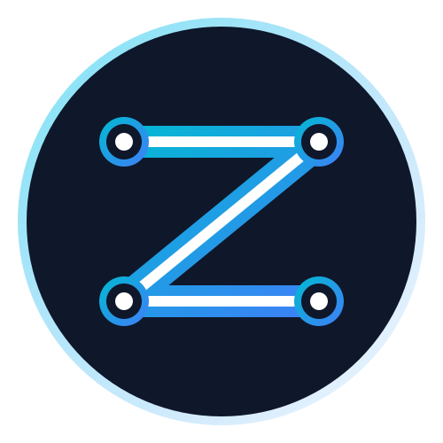

<div align="center">



# ZerithDB

### **Build full-stack apps with ZERO backend. The browser is the server.**

[](LICENSE)
[](https://github.com/zerithdb/zerithdb/actions/workflows/ci.yml)
[](https://badge.fury.io/js/@zerithdb%2Fsdk)
[](https://discord.gg/MhvuDvzWfF)
[](CONTRIBUTING.md)

[**Documentation**](https://zerithdb.dev/docs) · [**Live Playground**](https://playground.zerithdb.dev) · [**Discord**](https://discord.gg/MhvuDvzWfF) · [**Roadmap**](ROADMAP.md)

</div>

---

## What is ZerithDB?

ZerithDB is a **local-first, peer-to-peer application platform** that eliminates the need for traditional backend infrastructure. Think of it as Supabase — but instead of a centralized server, your users' browsers form a resilient, encrypted mesh network.

- **No backend to manage.** No servers, no databases, no DevOps.
- **Works offline.** All data lives locally first, syncs opportunistically.
- **Conflict-free by design.** CRDT-based sync means merges just work.
- **Private by default.** Public/private key identity — no passwords, no auth servers.

> ZerithDB is in **alpha**. APIs will change. Feedback is our oxygen — [open an issue](https://github.com/zerithdb/zerithdb/issues).

---

## The 30-Second Demo

```typescript
import { createApp } from "@zerithdb/sdk";

const app = createApp({ appId: "my-todo-app" });

// Write data — persisted locally via IndexedDB
await app.db("todos").insert({ text: "Ship ZerithDB v1", done: false });

// Query with a MongoDB-like API
const todos = await app.db("todos").find({ done: false });

// Enable real-time P2P sync — no server config needed
app.sync.enable();

// Authenticate with a keypair (no passwords, no servers)
const identity = await app.auth.signIn(); // generates or loads a keypair
console.log(identity.publicKey); // "did:key:z6Mk..."
```

That's it. No `.env` files. No `docker-compose.yml`. No cloud accounts.

---

## Features

| Feature | Description |
|---|---|
| 🗄️ **Local Database** | IndexedDB-backed via Dexie. MongoDB-style query API. Reactive live queries. |
| 🔄 **CRDT Sync** | Yjs-powered conflict-free sync. Merge without servers. Works across browser tabs, devices, and peers. |
| 🕸️ **P2P Network** | WebRTC mesh via `simple-peer`. Minimal signaling server (only for initial handshake). |
| 🔐 **Keychain Auth** | Ed25519 keypair identity. Sign-in is `generateKey()`. No email, no OAuth, no passwords. |
| 📦 **Modular SDK** | Tree-shakeable. Use only what you need. Works with React, Vue, Svelte, or vanilla JS. |
| ⚡ **Zero Config CLI** | `npx zerithdb init` bootstraps a full project in seconds. |

---

## Quick Start

### Option 1: CLI (Recommended)

```bash
npx zerithdb@latest init my-app
cd my-app
npm run dev
```

### Option 2: Manual Install

```bash
pnpm add @zerithdb/sdk
# or
npm install @zerithdb/sdk
```

### Minimal Setup

```typescript
import { createApp } from "@zerithdb/sdk";

const app = createApp({
  appId: "my-app-unique-id", // namespaces your local DB
  sync: {
    signalingUrl: "wss://signal.zerithdb.dev", // optional: use our hosted relay
    // or: signalingUrl: "ws://localhost:4000"  // self-hosted
  },
});
```

---

## Architecture in One Diagram

```
┌─────────────────────────────────────────────────────────┐
│                      Your Browser                        │
│                                                          │
│  ┌──────────┐   ┌──────────┐   ┌──────────────────────┐ │
│  │ ZerithDB │   │   Sync   │   │   P2P Network Layer  │ │
│  │   SDK    │──▶│  Engine  │──▶│  (WebRTC mesh)       │ │
│  └──────────┘   │  (CRDT)  │   └──────────────────────┘ │
│       │         └──────────┘            │               │
│       ▼              │                  │               │
│  ┌──────────┐        │          ┌───────▼──────┐        │
│  │ Local DB │◀───────┘          │  Signaling   │        │
│  │(IndexedDB│                   │  Server      │        │
│  └──────────┘                   │  (WS relay)  │        │
└──────────────────────────────── └──────────────┘ ───────┘
                                         ▲
                        Only for initial │ peer discovery
                                         │
                             ┌───────────┴──────────┐
                             │   Other Peer Browser  │
                             └──────────────────────┘
```

The signaling server **never sees your data**. It only brokers the initial WebRTC handshake. After that, peers communicate directly.

---

## Packages

| Package | Version | Description |
|---|---|---|
| [`@zerithdb/sdk`](packages/sdk) |  | Main developer-facing API |
| [`@zerithdb/db`](packages/db) |  | IndexedDB adapter (Dexie wrapper) |
| [`@zerithdb/sync`](packages/sync) |  | CRDT sync engine (Yjs) |
| [`@zerithdb/network`](packages/network) |  | WebRTC P2P layer |
| [`@zerithdb/auth`](packages/auth) |  | Keypair identity management |
| [`@zerithdb/core`](packages/core) |  | Internal types, events, utilities |
| [`@zerithdb/cli`](packages/cli) |  | `npx zerithdb init` CLI tool |

---

## Demo Applications

| App | Description | Live Demo |
|---|---|---|
| ✅ **Todo App** | Classic realtime todo with offline support | [todo.zerithdb.dev](https://todo.zerithdb.dev) |
| 📝 **Collaborative Notes** | Google Docs-style concurrent editing | [notes.zerithdb.dev](https://notes.zerithdb.dev) |
| 💬 **Offline Chat** | P2P chat — works even without internet | [chat.zerithdb.dev](https://chat.zerithdb.dev) |

---

## CLI Reference

```bash
# Scaffold a new ZerithDB app
npx zerithdb init <app-name>

# Add features interactively
npx zerithdb add auth
npx zerithdb add sync

# Start a local signaling server for development
npx zerithdb signal --port 4000

# Generate TypeScript types from your schema
npx zerithdb types --output ./src/db.types.ts
```

---

## Roadmap

See [ROADMAP.md](ROADMAP.md) for the phased plan.

Highlights:
- **v0.2** — React hooks (`useQuery`, `useLiveQuery`)
- **v0.3** — Server-assisted sync for large datasets
- **v0.4** — Fine-grained access control (capability tokens)
- **v1.0** — Stable API, plugin system, ecosystem launch

---

## Contributing

We are **actively looking for contributors**. ZerithDB is built in the open, and every PR matters.

```bash
git clone https://github.com/zerithdb/zerithdb.git
cd zerithdb
pnpm install
pnpm dev
```

Read [CONTRIBUTING.md](CONTRIBUTING.md) for the full workflow, coding guidelines, and how to find good first issues.

Good places to start:
- Issues labeled [`good-first-issue`](https://github.com/zerithdb/zerithdb/issues?q=label%3Agood-first-issue)
- Issues labeled [`help-wanted`](https://github.com/zerithdb/zerithdb/issues?q=label%3Ahelp-wanted)

---

## Community

| | |
|---|---|
| 💬 **Discord** | [discord.gg/MhvuDvzWfF](https://discord.gg/MhvuDvzWfF) |

---

## License

Apache 2.0 — see [LICENSE](LICENSE).

Built with ❤️ by the ZerithDB community.
